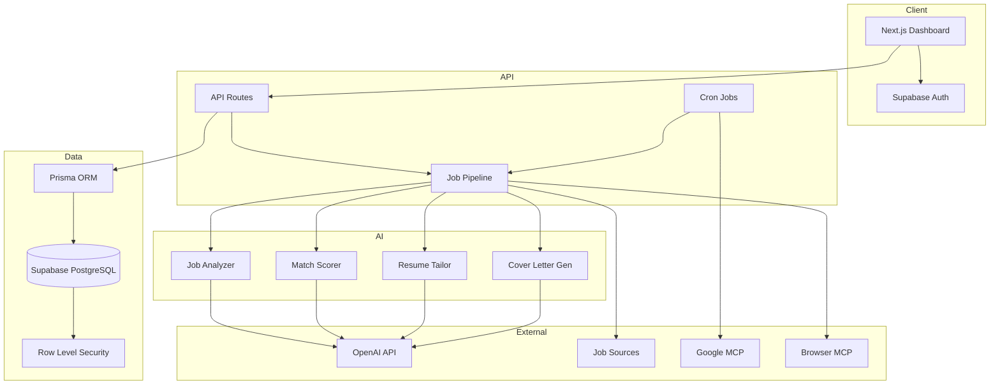
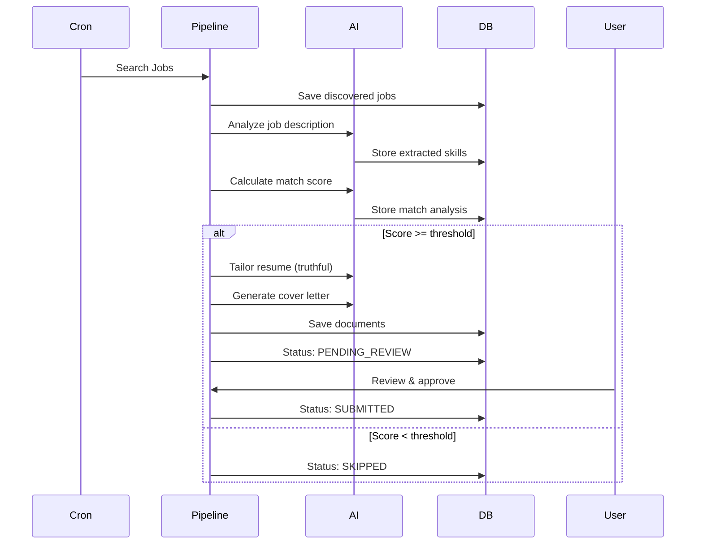

# Architecture

## System Overview



## Application Workflow



## Folder Structure

```
job-agent/
├── prisma/
│   └── schema.prisma          # Database schema
├── supabase/
│   └── migrations/            # SQL migrations with RLS
├── src/
│   ├── app/
│   │   ├── api/               # API routes
│   │   │   ├── cron/          # Background job cron
│   │   │   ├── health/        # Health check
│   │   │   ├── jobs/          # Job search & processing
│   │   │   ├── resumes/       # Resume management
│   │   │   └── settings/      # User settings
│   │   ├── dashboard/         # Dashboard pages
│   │   ├── login/             # Auth pages
│   │   └── signup/
│   ├── components/
│   │   ├── dashboard/         # Dashboard components
│   │   └── ui/                # shadcn/ui components
│   ├── lib/
│   │   ├── ai/                # AI modules
│   │   ├── data/              # Data access layer
│   │   ├── jobs/              # Job pipeline & adapters
│   │   ├── security/          # Encryption, rate limiting
│   │   └── supabase/          # Supabase clients
│   └── test/                  # Test setup
├── e2e/                       # Playwright E2E tests
├── docs/                      # Documentation
└── vercel.json                # Vercel deployment config
```

## Security Architecture

- **Authentication**: Supabase Auth with JWT tokens
- **Authorization**: Row Level Security on all user tables
- **Secrets**: AES-256-GCM encryption for stored credentials
- **Rate Limiting**: IP-based rate limiting on API routes
- **Audit Logging**: All sensitive actions logged
- **Environment Validation**: Zod schema validation for env vars

## AI Truthfulness Policy

All AI modules enforce strict rules:
1. Only use information from the master resume
2. Never invent qualifications or experience
3. Honest gap analysis in match scoring
4. Fallback heuristics when OpenAI is unavailable
